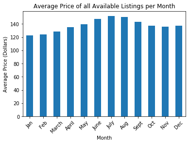

Ever wondered what might influence the pricing of a listing on Airbnb? When it might make more financial sense to plan a visit? 

Or, why all companies prefer to continue collecting seemingly endless amounts of data? Well, it's mostly so that they can answer questions like the ones above. 

In this quick post, I will aim to do the same. Airbnb, through [Kaggle](www.kaggle.com) and as part of their Inside Initiative, released a [dataset](https://www.kaggle.com/airbnb/seattle/data) describing listings in Seattle. 

I have analyzed the data, and aim to answer three questions based off of it below.

## 1. What is the average price of the listings in Seattle each month?

Some of us like to plan our travels well in advance, and sometimes knowing how the price of our stay fluctuates over time can be a huge benefit in saving costs. Keeping this in mind, I found out that the months of **June**, **July**, and **August**, have the highest average price (in dollars). 

| Month         | Average Price (dollars)|
| ------------- |:----------------------:|
| June          | 147.47                 | 
| July          | 152.09                 |
| August        | 150.66                 |

But wait! Before deciding on a month to travel to save some money, let's look at the distribution of the average prices. We can see that for some months the difference in prices might not be that drastic. 

  

Looking at the above, January and February might be your best options to save some money. 

## 2. What is the correlation between price of a listing, the amenities/services that listing offers, and the reviews of that listing?

The length of your stay can determine what amenities you might require at that particular listing. But do any of those amenities influence the price of that listing? What about the kind of reviews that listing gathers; do more positive reviews reflect higher pricing?

As it turns out, some of these findings might be a little counterintuitive. 

In an attempt to answer these questions, I calculated the correlation between these different variables to identify the relevant patterns. Following table displays the top 10, positive correlation coefficients with respect to the price of the listings.

| Amenity              | Correlation Coefficient|
| ---------------------|:----------------------:|
| Bedrooms             | 0.63                   | 
| Beds                 | 0.60                   |
| Bathrooms            | 0.53                   |
| Family/Kid Friendly  | 0.26                   | 
| Cable TV             | 0.26                   |
| TV                   | 0.20                   |
| Indoor Fireplace     | 0.15                   | 
| Air Conditioning     | 0.13                   |
| Hot Tub              | 0.13                   |

The number of Bedrooms, Beds, and Bathrooms are highly correlated with the price of the listing. Followed by whether or not the listing is family or kid friendly, and whether it has a TV or not. What's interesting, however, is that the quantitive aspects of reviews (like the total number, the ratings etc.) don't have a high positive correlation to the pricing.

## 3. Which property types have the highest average price?

Certain properties can have higher pricing than the rest. Through my analysis, I found out which property types have the highest average prices.

| Property Type         | Average Price (dollars)|
| ----------------------|:----------------------:|
| Boat                  | 282.38                 | 
| Condominium           | 151.11                 |
| Loft                  | 135.70                 |

We can visually check the average prices for other properties below as well -

  

So, someone could avoid looking for listings that have some of the more expensivev property types as shown above.

